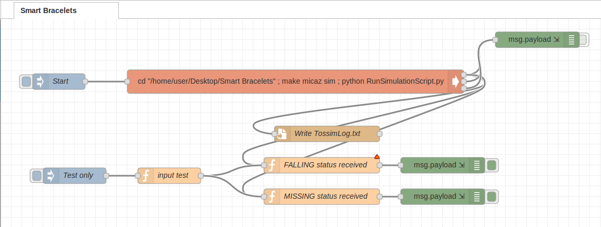

# SmartBracelets

## Introduction


The project requires to develop a pair of devices that at the boot begins a pairing phase, and after found the device to couple to, start to send periodic info messages containing information about the position coordinates and the kinematic status of the person who is wearing it (Standing, Walking, Running, Falling).

The project has been developed simulating the communication between the two couple of devices in the simulation environment TOSSIM.

## Project Files

- [SmartBracelets.h](SmartBracelets.h) contains the struct of the message sent by the two types of motes, and some constant useful to determine the status of the application
- [SmartBraceletsAppC.nc](SmartBraceletsAppC.nc) where all the used components were declared
- [SmartBraceletsC.nc](SmartBraceletsC.nc) contains the logic of all the application
- [RunSimulationScript.py](RunSimulationScript.py) contains the python code needed to execute the TinyOS SIMulator (TOSSIM),
- [topology.txt](topology.txt) contains configuration parameters for the 2 mote's antenna
- [meyer-heavy.txt](meyer-heavy.txt) contains data to use in TOSSIM to simulate communication noises.

## Run the simulation

To run the simulation, move to the project's folder then:

compile the project:
```
make micaz sim
```
execute the python code:
```
python RunSimulationScript.py
```


## Node-red
A node red flow it's used to filter bracelets's messages, looking for **FALLING** or **MISSING** messages and send a personalized alarm message with the status infos.


